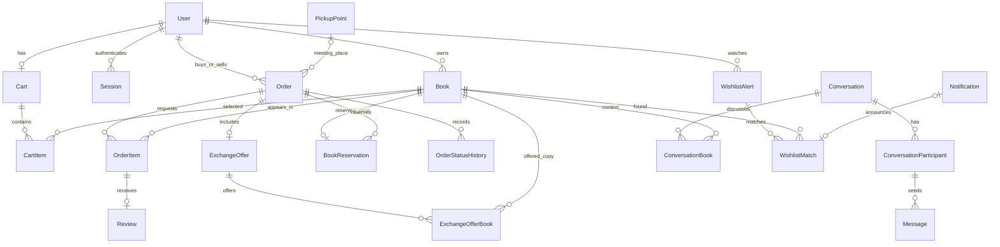

# Bookie database

The active database is PostgreSQL. All 33 table names, column names, enum types,
enum values, constraints and views are English. Prisma model names are physical
PascalCase table names (for example `Book`, `OrderItem`, `UserGenreInterest`).
Quote mixed-case names in manual SQL: `SELECT * FROM "Book";`.

## Local setup

From `backend/`:

```sh
npm install
npm run auth:setup
npm run db:local:start
npm run db:generate
npm run db:deploy
npm run db:seed
npm run db:status
npm run dev
```

`db:local:start` uses installed PostgreSQL binaries (Homebrew PostgreSQL 16 when
available, otherwise PATH; override the binary directory with `PG_BIN`). It creates
an isolated cluster in `backend/.local/postgres`, binds only `127.0.0.1:55432`, and
creates the `bookie` database. It does not start or alter existing Homebrew services.
The socket directory is inside the private `.local` directory. TCP authentication
uses SCRAM with the development-only credentials from `.env.example`.

Use `npm run db:local:status` and `npm run db:local:stop` to inspect/stop it. Data
persists across stops. On another PostgreSQL installation, create an empty Bookie
application database, set `DATABASE_URL`, and run generate/deploy/seed without the
local-cluster script. Provision separate credentials outside local development.

Use `npm run db:migrate -- --name describe_change` for future schema changes.
Use `db:deploy` to apply checked-in migrations. Do not use `db push` as setup: SQL
constraints, the review trigger and statistics views live in migration SQL.

The old SQLite database `backend/prisma/dev.db` remains unchanged. Its schema,
seed and four migrations are archived under `backend/prisma/legacy-sqlite/`.
The active PostgreSQL migration chain starts from an empty database and loads new
consistent fixtures; it does not silently import or discard SQLite records.

## Complete table inventory

| # | Table | Purpose and main relationships |
| --- | --- | --- |
| 1 | `User` | Required first/last name, normalized unique email, password hash, role, account status, profile, city, block expiry and archive timestamp |
| 2 | `Session` | Unique SHA-256 token digest, user, expiry and optional revocation timestamp; no raw session token |
| 3 | `City` | Editable/deactivatable city lookup for profiles, listing pickup cities and campus pickup points |
| 4 | `Genre` | Editable/deactivatable genre lookup linked to books, interests and wishlist criteria |
| 5 | `Language` | Editable/deactivatable language lookup linked to books, interests and wishlist criteria |
| 6 | `BookCondition` | Editable/deactivatable condition lookup with sort order |
| 7 | `Tag` | Administrator-managed global tags |
| 8 | `Book` | One physical listing: owner, required title/author/publisher/year/description/genre/language/condition, price, exchange flag, status, image URL, optional ISBN/course, views |
| 9 | `BookImage` | Multiple ordered images per listing, URL and optional alternative text |
| 10 | `BookPickupLocation` | Many-to-many book/city pickup locations |
| 11 | `BookTag` | Many-to-many book/global tag assignment |
| 12 | `UserGenreInterest` | Many-to-many buyer genre interests |
| 13 | `UserLanguageInterest` | Many-to-many buyer language interests |
| 14 | `Cart` | One cart per user |
| 15 | `CartItem` | Unique book within a cart; one physical copy, so no quantity field |
| 16 | `Order` | Buyer and seller, purchase/exchange type, state, total, BAM currency, notes, optional campus pickup point/address snapshot and transition timestamps |
| 17 | `OrderItem` | Requested book within an order; historical title, author and price snapshots; one review at most |
| 18 | `ExchangeOffer` | One offer attached to an exchange order |
| 19 | `ExchangeOfferBook` | Books supplied by the buyer in the exchange |
| 20 | `Review` | Rating 1–5, optional comment, edit deadline; order item determines book, buyer and seller without duplicated foreign keys |
| 21 | `Conversation` | Chat subject, optional order context, participants and linked books |
| 22 | `ConversationParticipant` | Membership, join time, last-read time; basis for unread counts |
| 23 | `ConversationBook` | One or more books discussed in a conversation |
| 24 | `Message` | Body, sender and conversation; composite foreign key requires the sender to be a participant |
| 25 | `Notification` | Order/message/review/system/wishlist notification, recipient, link, read flag and optional unique event key |
| 26 | `Report` | Reporter, exactly one target (book or user), reason/details, review state and administrator resolution |
| 27 | `WishlistAlert` | User's title/author/ISBN/genre/language criteria; at least one criterion required |
| 28 | `PickupPoint` | Campus location name/address/type, city, active flag; selectable on orders |
| 29 | `Badge` | Badge code/name/description/icon, active flag and eligibility thresholds |
| 30 | `UserBadge` | Awarded user badges with award timestamp |
| 31 | `BookReservation` | One reservation per physical book, attached to its order; covers requested and offered books |
| 32 | `OrderStatusHistory` | Previous/new order status, actor, optional note and timestamp |
| 33 | `WishlistMatch` | Unique alert/book match, optionally linked to its notification, to prevent repeated alerts |

`_prisma_migrations` is an additional Prisma-maintained technical table; it is not
one of the 33 application tables.

## Core relationships



## Modeling decisions

- Roles are `ADMIN`, `SELLER`, `BUYER`. No legacy `STUDENT` role. A buyer can own
  exchange-only listings; role-based service rules must permit this. A seller can
  also act as a buyer using the same account. Public registration cannot create an
  administrator; the database seed provisions the demo administrator directly.
- Account states are `ACTIVE`, `INACTIVE`, `BLOCKED`, `ARCHIVED`. A BLOCKED account
  with null `blockedUntil` is permanent. A temporary block uses a timestamp 15 days
  after the action. Other states cannot retain a block expiry. ARCHIVED requires
  `archivedAt`. The auth service will handle expired blocks and session revocation.
- Book states are `ACTIVE`, `RESERVED`, `SOLD`, `EXCHANGED`, `ARCHIVED`; no legacy
  `AVAILABLE`. Each listing is a physical copy. `publicId` is a unique public
  identifier; ISBN is indexed but intentionally not unique. Different copies can
  share an ISBN. Relisting creates a new listing and preserves the old history.
- Genre supports the required book categories; a second duplicate book-type table
  is unnecessary for this specification. Lookup labels remain editable.
- Money uses PostgreSQL `NUMERIC`: book/item prices are `(10,2)`, order totals are
  `(12,2)`, and currency is BAM. Negative values are forbidden. Zero-priced books
  must allow exchange; purchases have positive totals and exchanges have zero
  totals. Services must reject more than two decimal places before PostgreSQL
  rounds input and calculate totals from item price snapshots.
- Reviews have only `orderItemId`, not independently writable book/buyer IDs.
  This prevents attaching a review to a different book or buyer. A trigger checks
  that its order is completed on insert/update. Author identity comes from the
  order buyer. Buyer review listing and seller averages use those relationships.
- Order records, referenced books/users and required catalog lookups cannot be
  removed through cascading deletes. Archive instead. Ephemeral children such as
  sessions/cart items and catalog assignments have appropriate cascade behavior.
- Chats support buyer–seller and both roles with administrators. Book/order context
  is optional for support conversations; book conversations can include many books.
  Sender membership is database-enforced; read authorization remains a service rule.
- Images can be saved as URLs; `imageUrl` is the optional primary image and
  `BookImage` supports a gallery. Publication should require at least one usable
  image and pickup city in the book service, since these span child records.

## Derived values and the five additions

`BookStatistics` is a read-only SQL view with `bookId`, `averageRating`,
`ratingCount`, `completedOrderCount` and `popularityScore`. A completed exchange
counts on both requested and offered books. No fake rating/count caches exist.
Popularity currently uses `averageRating * 10 + completedOrderCount`. Since a
listing is one physical copy, its completed-order count is normally at most one;
these statistics are per listing, not a shared title/edition catalog.

`SellerStatistics` is a read-only SQL view with seller ID, total/active book counts,
completed order count, rating count and average rating. Ratings are weighted by
individual reviews, not averages of book averages. Both views reflect writes
immediately and are queried using Prisma raw SELECTs; they are not Prisma models.

| Original specification | Database support |
| --- | --- |
| Ecological impact | Derive reused physical book counts from completed order items and offered exchange books; environmental conversion needs a documented estimate, not a redundant statistics table |
| Price suggestion | Derive comparisons from Book condition/year/price/genre and completed OrderItem prices; the algorithm belongs in a service |
| Wishlist alerts | WishlistAlert criteria + WishlistMatch uniqueness + Notification event keys |
| Safe campus pickup | City → PickupPoint → Order, with pickup address snapshot |
| Seller badges | Badge eligibility thresholds + UserBadge, using SellerStatistics and chat timestamps |

Admin totals, books per seller and popular genre charts are queries over existing
records. They do not need separate writable tables. The ecological estimator,
price suggestion, matching and badge-award services are still to be implemented.

## Service rules to implement next

JWT login and registration are implemented; see [authentication.md](authentication.md).
The database foundation does not replace the remaining marketplace business logic:

1. Register only allowed roles, normalize email, hash passwords, issue random raw
   tokens to cookies and store only their SHA-256 digest. Check account state on
   each protected request; validate who can change lookup tables and account states.
2. A cart can span sellers, but each nonempty order must contain one seller's books,
   never the buyer's own. Validate current ownership/status and price inside the
   checkout transaction. Require at least one offered book on exchange orders,
   owned by the buyer and explicitly available for exchange.
3. Accept only PENDING orders. Atomically claim every requested/offered book in
   BookReservation, mark them RESERVED, update status/timestamps/history and create
   notifications. The primary key prevents competing reservations, but services
   must enforce that reservations belong to accepted orders and the right books.
4. Permit seller rejection of PENDING, buyer cancellation of PENDING, and seller
   completion of ACCEPTED. Complete both exchange sides, release reservations,
   preserve historical ownership and item prices, and prevent repeat completion.
   Terminal orders must not revert; the timestamp CHECK alone is not a transition
   or authorization engine. Resolve competing pending orders consistently.
5. Permit review creation only by the order buyer, enforce the optional 24-hour
   edit/delete window, and preserve completed order items. Prevent changing a
   reviewed order/item to invalidate eligibility.
6. Check chat membership before reads; validate order/book context and recipient
   access. Validate reporter/resolver roles and resolve reports atomically. Unread
   counts compare other senders' message timestamps with the participant's lastReadAt.
7. Match wishlist criteria, insert the match and recipient notification together;
   event uniqueness does not itself validate recipient identity. Award/revoke
   badges from their thresholds. Restrict campus pickup management to admins.

## Verification

`npm run db:validate` checks the Prisma model. `npm run test:db` creates a uniquely
named temporary PostgreSQL database, applies both migrations, seeds it and tests
all 33 tables, both views, migration replay/no drift, seed idempotency, constraints,
concurrent reservation uniqueness, review eligibility, chat sender membership,
report targets, wishlist deduplication, preserved history and homepage rendering.
It drops only its own temporary database on completion. The configured PostgreSQL
role needs CREATE DATABASE permission for this test suite; the local role has it.

The development fixture contains four users, eleven books and three orders. It
includes a sold copy with one real review, an accepted exchange with both copies
reserved, a pending purchase, interests/cart entries, all three chat pairings,
notifications, a report, wishlist match and an earned badge. No live sessions are
seeded. Reruns preserve existing records, passwords and moderation state. The demo
seed is disabled when `NODE_ENV=production`.

Implementation references: [Prisma migration history](https://www.prisma.io/docs/orm/v6/prisma-migrate/understanding-prisma-migrate/migration-histories)
and [PostgreSQL constraints](https://www.postgresql.org/docs/16/ddl-constraints.html).
